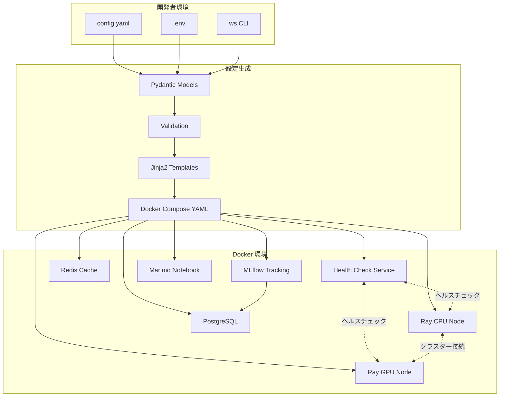
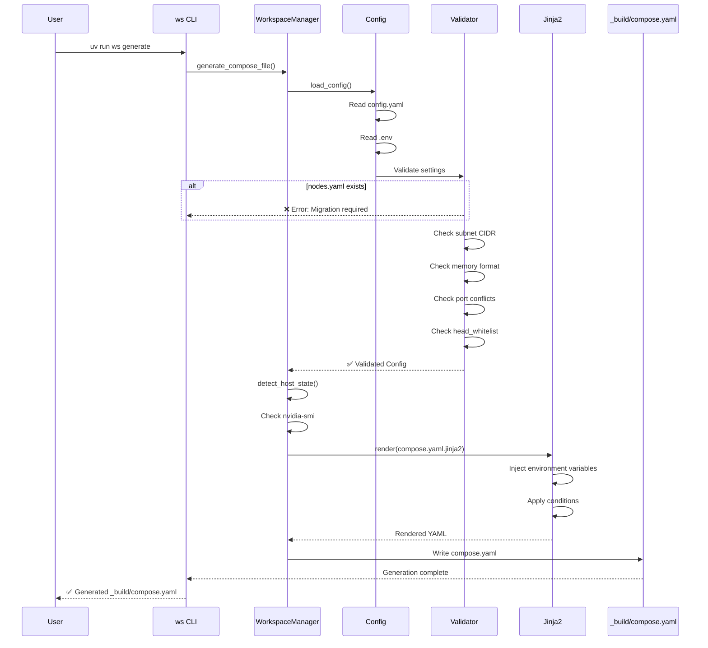
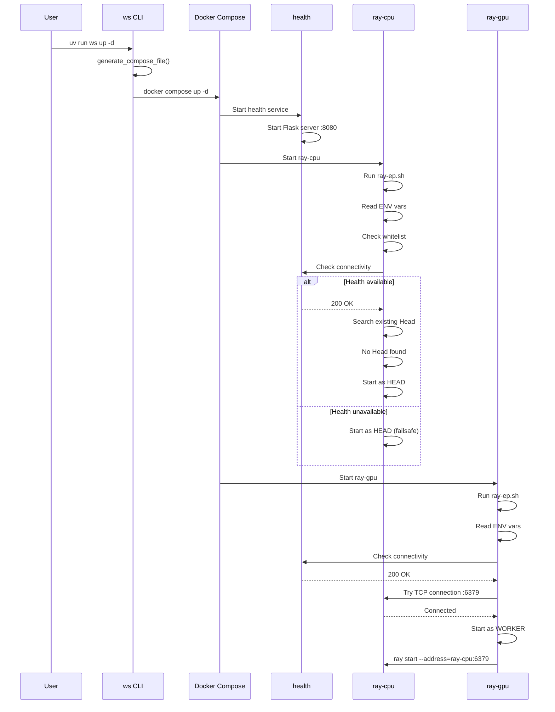
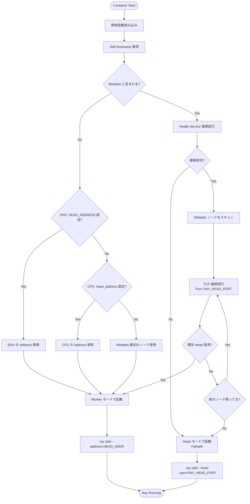
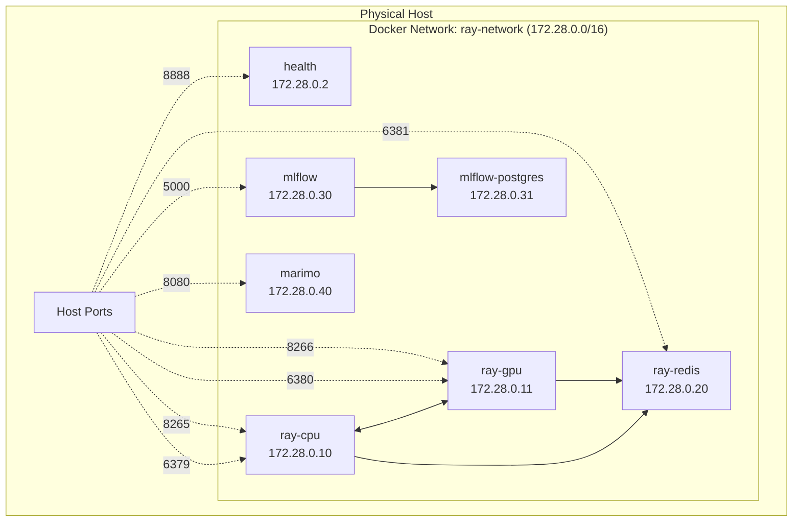
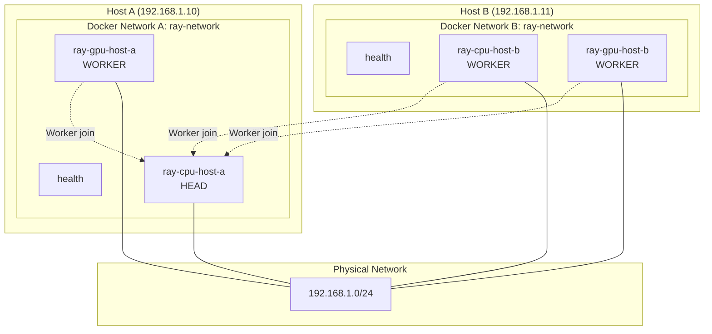
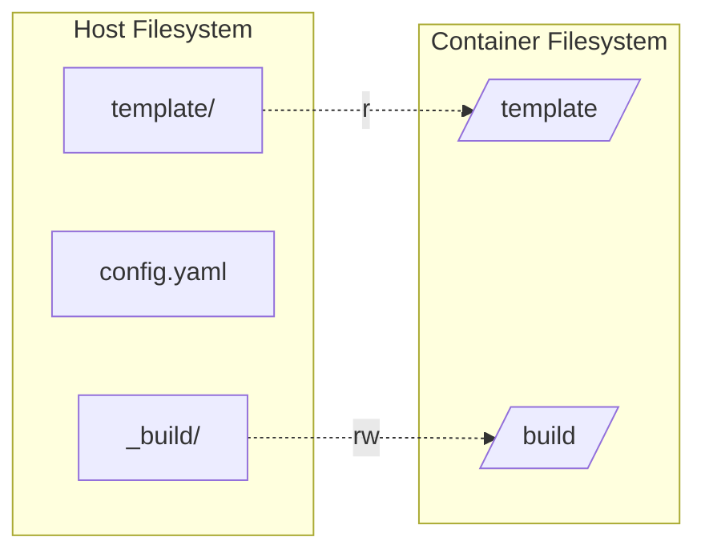
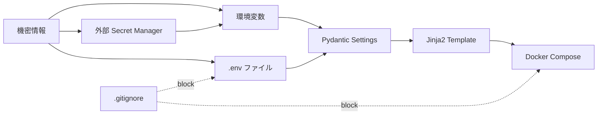
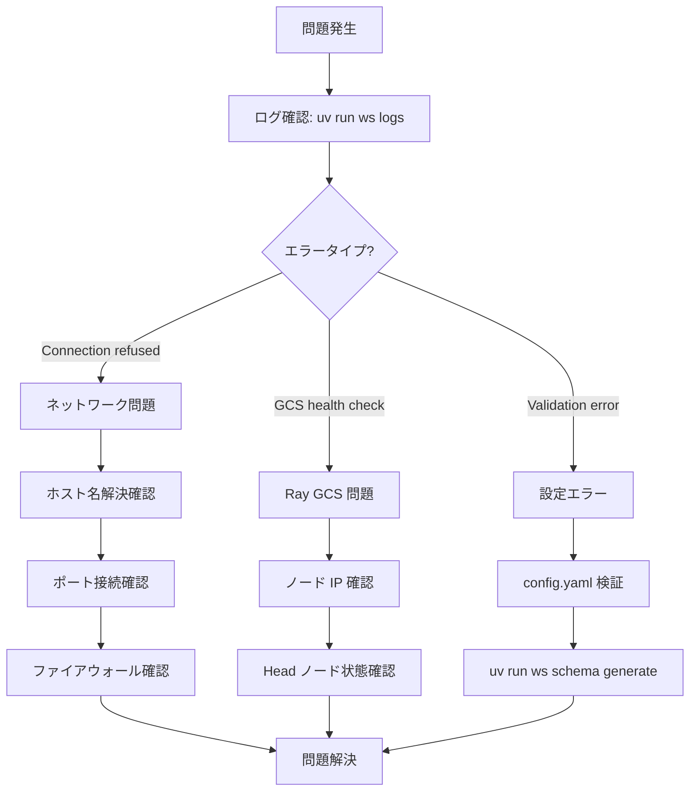

# System Architecture

CSLR Experiment Platform のシステムアーキテクチャとデータフロー

## 目次

- [概要](#概要)
- [アーキテクチャ概観](#アーキテクチャ概観)
- [コンポーネント構成](#コンポーネント構成)
- [設定生成フロー](#設定生成フロー)
- [Ray クラスター起動フロー](#ray-クラスター起動フロー)
- [Head/Worker 判定ロジック](#headworker-判定ロジック)
- [ネットワークアーキテクチャ](#ネットワークアーキテクチャ)
- [データ永続化](#データ永続化)

---

## 概要

CSLR Experiment Platform は、以下の設計原則に基づいています:

- **宣言的設定**: `config.yaml` でクラスター全体を定義
- **テンプレートベース**: Jinja2 テンプレートから Docker Compose 設定を生成
- **自動検出**: Head/Worker ロールを起動時に自動判定
- **マルチホスト対応**: 複数の物理ホストで分散クラスターを構築可能

---

## アーキテクチャ概観



---

## コンポーネント構成

### 1. 設定管理層

#### config.yaml
- **役割**: 全設定の単一ソース
- **フォーマット**: YAML
- **管理対象**: サービス有効/無効、リソース制限、ポート、ネットワーク、ノード設定

#### .env ファイル（オプション）
- **役割**: 機密情報とローカル設定の管理
- **優先度**: `config.yaml` より高い
- **用途**: パスワード、環境固有の設定

#### Pydantic Models (ws_src/models.py)
- **役割**: 設定の型定義とバリデーション
- **機能**:
  - `BaseSettings` による環境変数統合
  - CIDR、メモリ、ポートのバリデーション
  - JSON Schema 生成

### 2. テンプレートエンジン層

#### ws CLI (ws_src/commands.py)
- **役割**: ユーザーインターフェース
- **コマンド**: `init`, `generate`, `up`, `down`, `ps`, `logs`, `test`, `schema`
- **機能**: 設定読み込み、テンプレート処理、Docker Compose 呼び出し

#### WorkspaceManager (ws_src/manager.py)
- **役割**: テンプレート処理とファイル生成
- **機能**:
  - `load_config()`: 設定読み込みと検証
  - `detect_host_state()`: GPU 自動検出
  - `generate_compose_file()`: メイン Compose 生成
  - `generate_cluster_test_file()`: テスト Compose 生成
  - Legacy `nodes.yaml` 検出

#### Jinja2 Templates (template/)
- **compose.yaml.jinja2**: メインクラスター定義
- **cluster-test.compose.yaml.jinja2**: テストコンテナ定義
- **ray-ep.sh**: Ray ノードエントリポイント
- **health-ep.sh**: ヘルスチェックサーバー

### 3. ランタイム層

#### Health Check Service
- **役割**: ノード状態の監視と Head 候補の追跡
- **実装**: Python Flask（`template/health-ep.sh`）
- **エンドポイント**:
  - `GET /`: ヘルスステータス
  - 将来: ノード登録とリーダー選出

#### Ray Nodes
- **CPU ノード**: 汎用計算ノード
- **GPU ノード**: CUDA 対応計算ノード
- **起動スクリプト**: `ray-ep.sh`
- **モード**: Head または Worker（自動判定）

#### 統合サービス
- **MLflow**: 実験トラッキングとモデルレジストリ
- **Redis**: キャッシュと共有ストレージ
- **Marimo**: インタラクティブノートブック
- **PostgreSQL**: MLflow バックエンド

---

## 設定生成フロー



### 主要ステップ

1. **設定読み込み**: `config.yaml` + `.env` + 環境変数
2. **Legacy 検出**: `nodes.yaml` が存在する場合はエラー
3. **バリデーション**: Pydantic によるフィールドチェック
4. **GPU 検出**: `nvidia-smi` でホストのGPU状態を確認
5. **テンプレート処理**: Jinja2 でプレースホルダーを置換
6. **環境変数注入**: `nodes` 設定を環境変数として埋め込み
7. **ファイル出力**: `_build/compose.yaml` に書き込み

---

## Ray クラスター起動フロー



### 起動シーケンス

1. **Docker Compose 起動**: サービスがほぼ同時に起動
2. **Health Service 先行**: 他のノードより先に準備完了
3. **CPU ノード起動**: Whitelist 照合 → Head として起動
4. **GPU ノード起動**: Whitelist 照合 → 既存 Head 検出 → Worker として起動

---

## Head/Worker 判定ロジック

`ray-ep.sh` による自動判定の詳細フロー



### 判定条件の詳細

#### ホワイトリスト内ノード

| 条件 | Head | Worker |
|------|------|--------|
| Health 利用不可 | ✅ Failsafe | - |
| 既存 Head なし | ✅ First node | - |
| 既存 Head あり | - | ✅ Join cluster |

#### ホワイトリスト外ノード

常に Worker モードで起動し、以下の優先順位で接続先を決定:

1. 環境変数 `HEAD_ADDRESS`（最優先）
2. `config.yaml` の `nodes.head_address`
3. `nodes.head_whitelist` の最初のノード + `RAY_HEAD_PORT`

---

## ネットワークアーキテクチャ

### シングルホスト構成



### マルチホスト構成



**重要な設定**:

1. **ホスト名解決**: 各ホストで `/etc/hosts` または DNS 設定
   ```bash
   # Host A と Host B の /etc/hosts
   192.168.1.10 ray-cpu-host-a
   192.168.1.10 ray-gpu-host-a
   192.168.1.11 ray-cpu-host-b
   192.168.1.11 ray-gpu-host-b
   ```

2. **Firewall**: Ray ポートの開放
   ```bash
   # Host A
   sudo ufw allow 6379/tcp  # Ray Head port
   sudo ufw allow 8265/tcp  # Dashboard port
   ```

3. **Docker Hostname**: `docker-compose.yaml` で明示的に設定
   ```yaml
   services:
     ray-cpu:
       hostname: ray-cpu-host-a  # Whitelist と一致
   ```

---

## データ永続化

### ボリューム構成

```yaml
volumes:
  mlflow-data:        # MLflow アーティファクト
  postgres-data:      # PostgreSQL データベース
  redis-data:         # Redis 永続化（オプション）
  marimo-notebooks:   # Marimo ノートブック
  ray-temp:           # Ray 一時ファイル
```

### ディレクトリマウント



**マウントのポリシー**:
- **Read-Only (ro)**: テンプレート、スクリプト（コンテナは変更しない）
- **Read-Write (rw)**: ログ、生成ファイル（コンテナが書き込む）
- **Named Volume**: データベース、永続ストレージ

---

## セキュリティ考慮事項

### 機密情報の管理



**推奨事項**:
1. `.env` ファイルで機密情報を管理（Git に含めない）
2. `config.yaml` にはプレースホルダーのみ記載
3. 本番環境では外部 Secret Manager（AWS Secrets Manager, HashiCorp Vault など）を使用

### ネットワークセキュリティ

- **内部通信**: Docker ネットワーク内で完結
- **外部公開**: 必要最小限のポートのみホストに露出
- **ファイアウォール**: マルチホストでは Ray ポートを適切に制限

---

## パフォーマンス最適化

### リソース配分戦略

#### CPU vs GPU ノード

| ノード | 推奨 CPU | 推奨メモリ | 推奨 SHM | 用途 |
|--------|---------|-----------|----------|------|
| CPU ノード | 4-8 コア | 8-16GB | 2-4GB | 汎用計算、前処理 |
| GPU ノード | 16-32 コア | 32-64GB | 8-16GB | 深層学習、推論 |

#### 共有メモリ (shm_size)

Ray はオブジェクトストアに `/dev/shm` を使用します:

```yaml
services:
  ray:
    gpu:
      shm_size: "16g"  # 大規模データセット処理に推奨
```

**計算式**: `shm_size ≈ memory × 0.3`（Ray オブジェクトストア用）

### ネットワーク最適化

- **サブネット サイズ**: `/16` (65,536 アドレス) を推奨
- **MTU**: デフォルト 1500、Jumbo Frame (9000) も検討可
- **DNS キャッシュ**: マルチホストでは DNS サーバーの使用を推奨

---

## トラブルシューティングフロー



---

## 拡張性

### 今後のアーキテクチャ拡張

1. **Kubernetes サポート**: Helm チャートへの変換
2. **Auto-scaling**: Ray Autoscaler との統合
3. **モニタリング**: Prometheus + Grafana
4. **ログ集約**: ELK Stack または Loki
5. **サービスメッシュ**: Istio による高度なネットワーク制御

### プラグインアーキテクチャ

将来的に、カスタムサービスを追加可能な設計:

```yaml
# 将来の拡張例
services:
  custom:
    my_service:
      enabled: true
      image: "my-org/my-service:latest"
      port: 9000
```

---

## 関連ドキュメント

- [README.md](../README.md) - クイックスタート
- [docs/config-reference.md](config-reference.md) - 設定リファレンス
- [CHANGELOG.md](../CHANGELOG.md) - 変更履歴
- [notes/test-cluster-readme.md](../notes/test-cluster-readme.md) - テストクラスター
