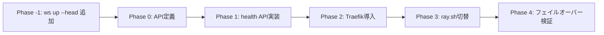
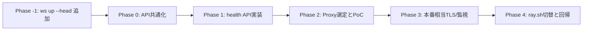
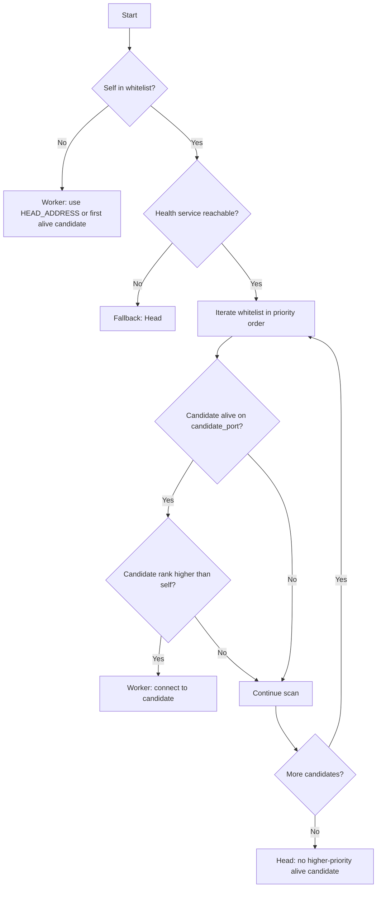
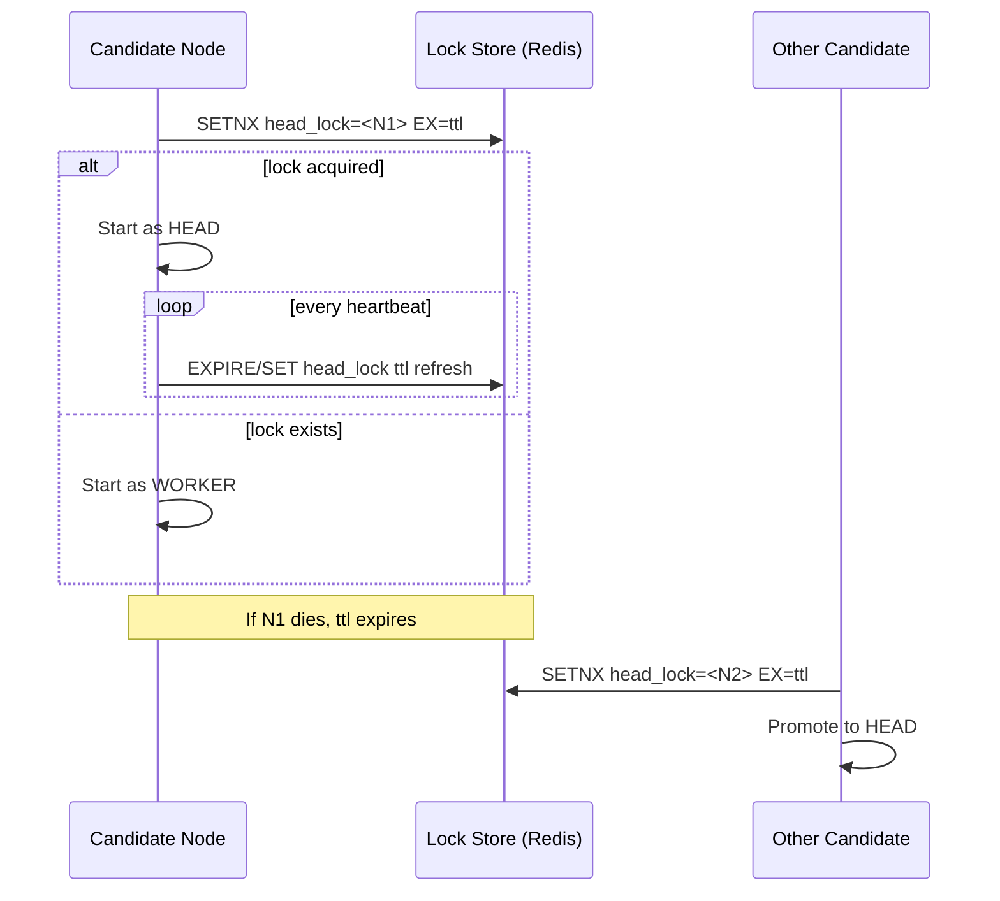

# Head Node 検出ロジック候補レポート

## 背景

現行の課題は、候補ノードごとに `head_port` が異なる場合に、探索側が自ノードの `RAY_HEAD_PORT` で相手を探してしまい、
相互検出が失敗して split-brain（複数 HEAD）になり得る点です。

本ドキュメントでは、候補C（health 仲介 API）をベースに、
次の2案の段階的実装計画を先頭に定義します。

1. `health api + traefik`
2. `other http(s)`（nginx/caddy/envoy など）

---

## 採用候補 1: health API + Traefik（優先）

### 目標

- ノードは `ray-health.{host.fqdn}` の HTTPS 固定エンドポイントにのみ依存
- 外部から実ポート不明でも、API で head 判定と接続先取得ができる
- 既存の Ray 多ポート通信は維持し、HTTP 制御面のみをプロキシ化

### 段階計画

#### Phase -1: `ws up --head [host[:port]]` 追加

- `ws up` に `--head [host[:port]]` を追加（0〜1引数）
- `--head` のみ（引数なし）:
    - 自ノードを強制 HEAD として起動
- `--head host[:port]`:
    - 指定 `host[:port]` を HEAD として WORKER 接続
- `--head` 未指定:
    - 本ドキュメントの head-node-detection-logic-candidates ロジック（候補C）へ移行
- 上記により、Phase 1 以降の API 導入前でも手動オーバーライドで運用可能にする

#### Phase 0: API/データモデル固定

- エンドポイント定義
  - `POST /v1/nodes/register`
    - `POST /v1/head/acquire`
    - `POST /v1/head/heartbeat`
    - `GET /v1/head/current`
- レスポンスに `head_host`, `head_port`, `head_client_port` を含める
- TTL・再選出条件・優先順位ルール（whitelist順）を明文化
- ホスト外部ネットワーク向けの公開ポートは `services.health.port` と `services.traefik.port` を参照する

#### Phase 1: health API 実装（現 `health.py` 拡張）

- 現行 `OK` 応答に加え、上記 API を同一プロセスで提供
- メモリ実装から開始（再起動で揮発）
- `lease_version` を持たせ、古い heartbeat を拒否

#### Phase 2: Traefik 導入

- `traefik` サービス追加（entrypoint: `:443`）
- `Host(\`ray-health.{host.fqdn}\`)` で health API にルーティング
- 証明書は最初は自己署名/内部CA、後で ACME に切替可能設計
- ホスト外部ネットワークには `services.traefik.port` を公開し、直接公開が必要な期間のみ `services.health.port` を利用する

#### Phase 3: ray.sh の検出ロジック切替

- 既存 TCP 探索を段階的に無効化
- `acquire` 成功なら HEAD、失敗時は `current` の head に worker 接続
- フォールバック条件（health API 不達時）を明示

#### Phase 4: 検証と移行

- 正常系: 先行起動ノードが HEAD、後続は WORKER
- 異常系: HEAD 停止時の再選出、ネットワーク断、遅延 heartbeat
- シナリオ1/2/3 回帰

---

## 採用候補 2: other HTTP(S)（Traefik以外）

### 想定

- L7 プロキシを nginx / caddy / envoy で代替
- health API の仕様・ノード側の利用方法は候補1と共通

### 段階計画

#### Phase -1（共通）

- `ws up --head [host[:port]]` を候補1と同じ仕様で先行実装
- `--head` 未指定時のみ、候補1/2 共通の検出ロジックへ進む

#### Phase 0-1（共通）

- 候補1と同じ API 契約で health サービスを先に実装

#### Phase 2: Proxy 選定 PoC

- nginx: 静的設定中心、運用標準がある場合に有利
- caddy: TLS 自動化が容易
- envoy: 高機能だが運用コスト高

#### Phase 3: TLS・可観測性

- mTLS/アクセス制御要件に応じてプロキシを確定
- access log / error log / trace ヘッダを統一

#### Phase 4: 切替

- ray.sh は API クライアント化（候補1と同一）
- 差分は L7 プロキシ設定のみ

---

## 比較と推奨

| 観点 | 1. health API + Traefik | 2. other HTTP(S) |
|---|---|---|
| 導入速度 | 速い | 中 |
| Docker連携 | 高い（ラベル駆動） | 中（静的設定寄り） |
| 運用自由度 | 中 | 中〜高 |
| 本案件適合 | 高 | 中 |

**推奨**: まずは **1. health API + Traefik** を優先採用し、
監査要件や既存標準の都合がある場合にのみ **2. other HTTP(S)** へ切替可能な設計（API共通）を維持する。

---

## 付録A（未採用）: 候補A 固定優先順位 + 候補別ポート探索

- ホワイトリスト順に優先順位
- `HEAD_PORT_MAP` で候補別ポートを参照
- 高優先ノード生存時は worker 化

未採用理由:

- split-brain 抑止が「ベストエフォート」に留まる
- 中長期の運用可視性（状態API）を得にくい

---

## 付録B（未採用）: 候補B ロックサービス方式（分散ロック）

- `head_lock` を TTL 付きで保持
- lock 保持ノードのみ HEAD
- lock 失効時に再選出

未採用理由:

- 追加依存（KVストア）の運用負荷が増える
- 本件はまず API 仲介方式で十分に要件を満たせる
