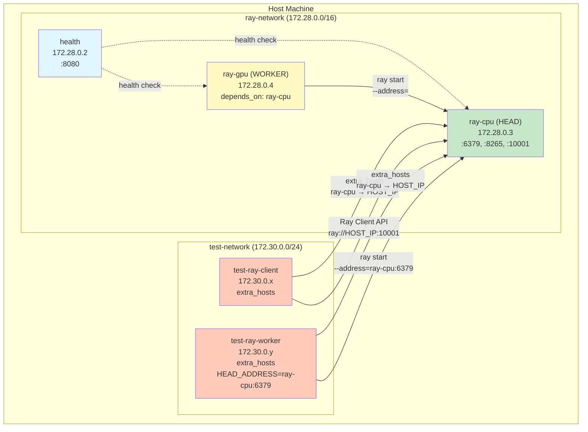

# Cluster Test Architecture

## 概要

cluster-test は Ray クラスタの自動構成機能（HEAD/WORKER 自動検出）を検証するための統合テスト環境です。メインクラスタとは独立したネットワーク空間でテストコンテナを起動し、`extra_hosts` を使ってホストマシン経由でメインクラスタへの接続を確認します。

## アーキテクチャ



## コンポーネント

### メインクラスタ (ray-network)

#### 1. health
- **役割**: ヘルスチェックサーバー（HEAD 候補ノードの起動順序制御）
- **Image**: `python:3.12-alpine`
- **Port**: 8080
- **機能**: 
  - HTTP GET `/` で 200 OK を返す
  - ray-ep.sh が既存 HEAD の存在を確認する際に使用

#### 2. ray-cpu (HEAD)
- **役割**: メインクラスタの HEAD ノード
- **Image**: `rayproject/ray:latest`
- **Hostname**: `ray-cpu`
- **Whitelist**: ✅ (`config.yaml` の `nodes.head_whitelist` に含まれる)
- **起動モード**: HEAD
  - Health service 確認 → ✓
  - 既存 HEAD 検索 → なし
  - `ray start --head --dashboard-host=0.0.0.0 --port=6379`
- **Ports**: 
  - 6379: Ray head port
  - 8265: Dashboard
  - 10001: Ray Client Server

#### 3. ray-gpu (WORKER)
- **役割**: メインクラスタの WORKER ノード
- **Image**: `rayproject/ray:latest-gpu`
- **Hostname**: `ray-gpu`
- **Whitelist**: ✅ (head_whitelist に含まれるが depends_on により起動遅延)
- **depends_on**: `ray-cpu`, `health`
- **起動モード**: WORKER
  - Health service 確認 → ✓
  - 既存 HEAD 検索 → ray-cpu を発見
  - `ray start --address=ray-cpu:6379`
- **Ports**: 6380, 8266, 10002

### テストコンテナ (test-network)

#### 4. test-ray-client
- **目的**: Ray Client API の接続テスト
- **Network**: test-network (172.30.0.0/24) - メインクラスタから隔離
- **extra_hosts**: 
  ```yaml
  - "ray-cpu:{{ host.ip_address }}"
  - "health:{{ host.ip_address }}"
  ```
- **テスト内容**:
  1. ネットワーク接続確認 (ping, port check)
  2. Ray Client API 接続: `ray.init("ray://HOST_IP:10001")`
  3. クラスタリソース取得: `ray.cluster_resources()`
- **終了動作**: `tail -f /dev/null` でデバッグ可能状態を維持

#### 5. test-ray-worker
- **目的**: whitelist 外ノードの自動 WORKER 化テスト
- **Hostname**: `test-ray-worker` (`config.yaml` の `nodes.head_whitelist` に **含まれない**)
- **環境変数**: `HEAD_ADDRESS=ray-cpu:6379` (明示的な接続先指定)
- **extra_hosts**: ray-cpu, health をホストマシン経由で解決
- **起動フロー**:
  1. ray-ep.sh 実行
  2. Hostname チェック → whitelist に含まれない
  3. HEAD_ADDRESS 環境変数を使用
  4. `ray start --address=ray-cpu:6379` で WORKER として起動
- **検証ポイント**: 
  - ✓ ホワイトリスト外ノードが自動的に WORKER になる
  - ✓ HEAD_ADDRESS 環境変数による接続先オーバーライド
  - ✓ クラスタへの参加成功（CPU リソースが増加）

## ネットワーク分離戦略

### なぜ test-network を分離するのか？

1. **純粋な接続テスト**: 
   - メインクラスタと同一ネットワークだと Docker の内部 DNS で自動解決される
   - `extra_hosts` + ホスト経由の接続をテストするため分離が必要

2. **本番環境シミュレーション**:
   - 外部ホストから Ray クラスタに接続する状況を再現
   - NAT/ポートフォワーディング経由の接続パターンを検証

3. **構成の柔軟性**:
   - `extra_hosts` で明示的に名前解決をコントロール
   - ホストマシンの IP アドレス (`{{ host.ip_address }}`) 経由で接続

## テストシナリオ

### シナリオ 1: HEAD/WORKER 自動検出

**前提条件**:
- `config.yaml` の `nodes.head_whitelist`: `[ray-cpu, ray-gpu]`
- ray-cpu が先に起動 (depends_on なし)
- ray-gpu が後に起動 (depends_on: ray-cpu)

**期待される動作**:
```
1. health → 起動 (PORT 8080)
2. ray-cpu → health 確認 → 既存 HEAD なし → HEAD として起動
3. ray-gpu → health 確認 → ray-cpu を発見 → WORKER として起動
```

**検証**:
```bash
docker exec cslr-exp-platform-ray-cpu ray status
# Expected: 2 nodes (ray-cpu + ray-gpu)
```

### シナリオ 2: Whitelist 外ノードの WORKER 化

**前提条件**:
- test-ray-worker の hostname は whitelist に **含まれない**
- `HEAD_ADDRESS=ray-cpu:6379` 環境変数を設定

**期待される動作**:
```
1. ray-ep.sh 起動
2. Hostname "test-ray-worker" を確認
3. head_whitelist を検索 → 該当なし
4. HEAD_ADDRESS 環境変数を使用
5. ray start --address=ray-cpu:6379 (WORKER モード)
```

**検証**:
```bash
docker logs cslr-exp-platform-test-worker 2>&1 | grep "Mode:"
# Expected: Mode: worker

docker exec cslr-exp-platform-ray-cpu ray status
# Expected: 3 nodes (ray-cpu + ray-gpu + test-ray-worker)
```

### シナリオ 3: Ray Client API 接続

**前提条件**:
- ray-cpu が Ray Client Server を起動 (PORT 10001)
- test-ray-client が test-network から `extra_hosts` 経由で接続

**期待される動作**:
```python
ray.init("ray://HOST_IP:10001")
# → ray-cpu に接続
# → クラスタリソース情報取得成功
```

**検証**:
```bash
docker logs cslr-exp-platform-test-client 2>&1 | grep "Ray client"
# Expected: ✓ Ray client connected
```

## 使用方法

### 1. 通常のクラスタ起動

```bash
# compose.yaml 生成 + クラスタ起動
uv run ws up

# クラスタ状態確認
uv run ws ps
docker exec cslr-exp-platform-ray-cpu ray status
```

### 2. Cluster Test 実行

```bash
# cluster-test.compose.yaml 生成 + テストコンテナ起動
uv run ws test --up

# テストログ確認
docker logs cslr-exp-platform-test-client 2>&1 | tail -50
docker logs cslr-exp-platform-test-worker 2>&1 | tail -50

# クラスタ統合確認（3 nodes になるはず）
docker exec cslr-exp-platform-ray-cpu ray status
```

### 3. HEAD_ADDRESS オーバーライドテスト

```bash
# カスタム HEAD アドレスを指定
uv run ws test --up --head ray-gpu:6380

# test-ray-worker が ray-gpu に接続することを確認
docker logs cslr-exp-platform-test-worker 2>&1 | grep "HEAD_ADDRESS"
```

### 4. クリーンアップ

```bash
# テストコンテナのみ停止
uv run ws test --down

# 全体停止
uv run ws down
```

## 検証項目チェックリスト

### ✅ クラスタ構成
- [ ] ray-cpu が HEAD として起動
- [ ] ray-gpu が WORKER として起動（depends_on 効果）
- [ ] ray status で 2 nodes 確認
- [ ] CPU: 8.0 (ray-cpu:4 + ray-gpu:4)
- [ ] Memory: 約 16 GiB

### ✅ Health Service
- [ ] health コンテナが PORT 8080 で起動
- [ ] curl http://health:8080 で 200 OK
- [ ] ray-ep.sh から接続可能

### ✅ Ray Dashboard
- [ ] http://localhost:8265 でアクセス可能
- [ ] Cluster タブで 2 nodes 表示
- [ ] Logs タブでログ確認

### ✅ Test Ray Client
- [ ] test-network から ray-cpu へ ping 成功
- [ ] PORT 6379, 10001 への接続成功
- [ ] Ray Client API で ray.init() 成功
- [ ] ray.cluster_resources() でリソース取得

### ✅ Test Ray Worker
- [ ] Hostname が whitelist 外であることを検出
- [ ] HEAD_ADDRESS 環境変数を使用
- [ ] WORKER モードで起動
- [ ] ray-cpu クラスタへの参加成功
- [ ] ray status で 3 nodes に増加

### ✅ 設定注入
- [ ] `config.yaml` の `nodes` 設定が compose 生成時に環境変数へ注入される
- [ ] `HEAD_WHITELIST` / `HEALTH_URL` / `HEAD_ADDRESS_CFG` が期待値になる
- [ ] Whitelist 判定が正常動作

### ✅ PATH 解決
- [ ] ray コマンドが見つかる
- [ ] /home/ray/anaconda3/bin が PATH に含まれる
- [ ] su - ray で login shell 環境が読み込まれる

## トラブルシューティング

### test-ray-worker が HEAD として起動してしまう

**原因**: depends_on が設定されていないか、起動タイミングで ray-cpu を検出できなかった

**解決策**:
```yaml
# cluster-test.compose.yaml.jinja2
test-ray-worker:
  depends_on:
    - ray-cpu
```

### test-ray-client で python3: command not found

**原因**: inline bash command が root ユーザーコンテキストで実行され、/home/ray/anaconda3/bin が PATH に含まれない

**解決策**:
```bash
su - ray -c "python3 -c '...'"
```

### "Node not in whitelist" だが実際は含まれている

**原因**: `config.yaml` の `nodes.head_whitelist` とコンテナ `hostname` が不一致

**解決策**: `config.yaml` の `nodes.head_whitelist` と compose の `hostname` を一致させる

### ray-gpu が独立した HEAD になる

**原因**: depends_on が機能していない、または health service が見つからない

**解決策**:
```yaml
ray-gpu:
  depends_on:
    - ray-cpu
    - health
```

## 関連ファイル

- [`template/cluster-test.compose.yaml.jinja2`](template/cluster-test.compose.yaml.jinja2): テンプレート定義
- [`template/ray-ep.sh`](template/ray-ep.sh): HEAD/WORKER 自動検出スクリプト
- [`config.yaml`](config.yaml): Whitelist とヘルスチェック設定（`nodes` セクション）
- [`ws`](ws): CLI ツール（`test --up/--down/--head` コマンド）
- [`README.md`](README.md): メインプロジェクトドキュメント

## 設計思想

### 1. ゼロコンフィグレーション
- Whitelist に基づく自動 HEAD 選出
- Whitelist 外ノードは自動的に WORKER モード
- 環境変数による柔軟なオーバーライド

### 2. 冪等性と再起動耐性
- Health service による起動順序制御
- 既存 HEAD の検出と衝突回避
- depends_on による明示的な依存関係

### 3. 開発者体験の最適化
- `ws test --up` 一発でテスト環境構築
- ログに絵文字付き進捗表示（✓/✗/→）
- tail -f /dev/null でデバッグ可能な状態を維持

### 4. 本番環境との整合性
- compose.yaml と cluster-test.compose.yaml で同じ ray-ep.sh を使用
- ネットワーク分離によるリアルな接続テスト
- extra_hosts で NAT/ポートフォワーディングをシミュレーション
